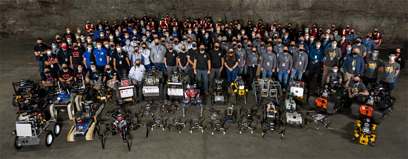
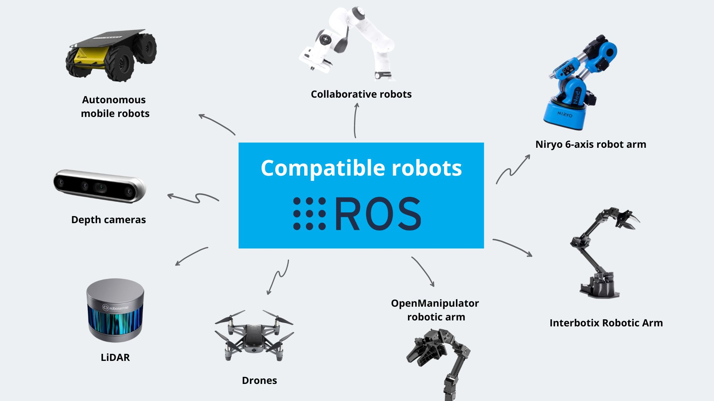

### 如果你想创造一个智能体，这可能是最快了解它的媒介----ROS

#### 欢迎加入我们！！！

图片来自DARPA Subterranean (SubT) Challenge

### 什么是ROS？

机器人操作系统（ROS- Robot Operating System）是用于编写机器人软件的灵活框架。目的在提高模块化能力和复用能力，从而简化任务量，方便多种机器人平台之间创建复杂和鲁棒的机器人行为，它是工具、库和约定的集合。

首先，ROS是中间件+工具链。中间件包括一些通信模块和通信底层，如TF或比较重要的核心库，ROS作为中间件连接了操作系统和用户开发的ROS应用程序。工具链是工程管理的一个工具，例如其中的可视化工具可以快速完成logging、回放和调试。

其次，ROS是一种事实上的标准，它已经集成了很多message的定义，这些定义不依赖于平台，也不依赖于语言，所以ROS是一个更高层的定义。

在此层面上来说，支持ROS的某一个message接口，就等于完成机器人系统中的一个模块，相当于搭积木，只要中间的接口一样，便能将其更换。即ROS平台具有很好的模块化性能。

此外，ROS也是开源社区，现在全世界已有超过2000个package在ROS的开源平台之上。

### 为什么是ROS？

为什么要用ROS呢？首先它是可以快速实现demo、高兼容性的、模块化的一个开发工具，极大地提高了机器人领域的代码复用率。所以核心点在于，如果有一个工具可用，而且很多人用的很好，并且能满足需求，那就不应该重新造一个轮子。

有些人可能喜欢自己做很底层的东西，以此彰显自己的coding技术很牛或者获取成就感。作为锻炼的话这是没有问题的，但写出的东西，如果要作为比较底层的布局使用，其实需要非常大量的测试。这些测试，如果只是随便完成的话，很可能会出现问题。尤其是将它放入一个工程中时，很可能会导致其他依赖它的东西受到巨大影响。

而现在ROS有庞大的使用人群和维护人群，所以它的核心库有非常高的质量保证。在此情况下，只要它真的能满足需求，我们就应该使用好这个工具，并且还大量支持工具、兼容产品。此外，它的软件协议比较友好，核心模块都是BSD，可以直接商用。

## 学习资料
https://www.ros.org/
https://robot.czxy.com/docs/ros/
https://sychaichangkun.gitbooks.io/ros-tutorial-icourse163/content/

**bilibili**
https://www.bilibili.com/video/BV1mJ411R7Ni/?spm_id_from=333.337.search-card.all.click

## 附件

[机器人工程师学习计划](./机器人工程师学习计划%20-%20知乎专栏.pdf)