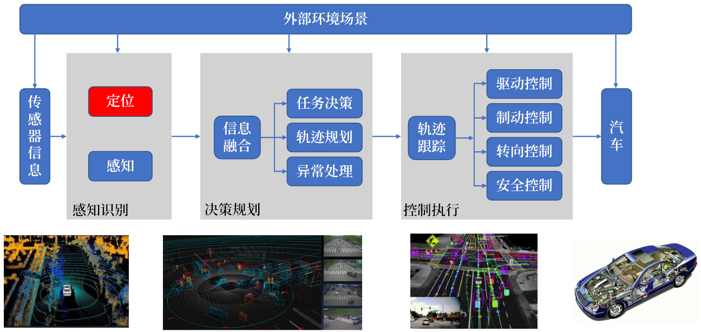
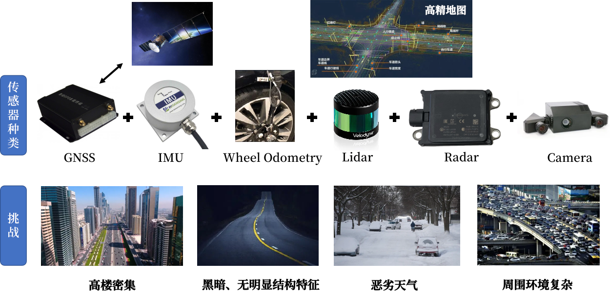

## 自动驾驶框架概述
自动驾驶技术从业务流程上分为3个核心的流程，分别是环境感知定位、决策规划、执行控制。这3个核心流程的具体价值如下：

- 环境感知定位：主要是通过传感器技术和摄像头、GPS等技术获取汽车行驶过程中的环境指标，并且将数据采集
- 决策规划：通过收集的数据，对车辆的下一步行为作出判断和指导
- 执行决策：目前大部分车辆都采用线控设计，如何将决策通过信号指令控制汽车的油门、制动等相关系统

### 自动驾驶框架

一个智能体能够自主运行，首先要确定自主移动机器人在全局地图中的位置，同时对周围环境目标、障碍物进行检测；定位信息和环境感知作为输入，规划出一条满足运动学约束的路径，下发控制指令；接收规划的控制指令，使用控制算法控制机械结构实现精准的平滑控制。
感知、规划和控制功能系统要求对车辆的位置有准确的了解，以执行正确的驾驶决策和行动。例如，几个分米的误差可能导致车辆将自己定位在错误的一边，可能导致行人和骑自行车的人等易受伤害的用户发生事故。

### 自动驾驶中的挑战和应对措施

为了应对自动驾驶汽车在驾驶中遇到的一些挑战，一般会采用多传感器融合的方式，来弥补不同传感器之间的物理特性的缺陷，从而应对多种复杂的挑战环境。
#### 目前的定位方案
常规定位方法：差分GPS+惯性导航IMU，基于Signal Point Positioning (SPP)定位的精度在空旷环境下，可达到5-10m（因为天气原因，电离层，太阳活动不一样，所以在一定范围内波动），在城市环境下，特别是有高楼密集环境下，定位精度20-300m；RTK GPS，在常规建筑物不太密集的环境下，定位精度可达到厘米级别，但在高楼密集的环境下，定位误差依旧可达到20-30m

IMU可以在短时间内提供精确的运动预测。车轮编码器，当结合车辆的运动学约束，也可以在短时间内提供精确的运动预测。IMU和车轮编码器提供的运动预测不仅可以为点云配准提供初始值，还可以用于平滑定位结果。

GPS设备信息更新频率较低，大约是10Hz级别，对于高速行驶车辆显然是远远不够的，通过获取车辆的速度、车轮转角等信息，积分计算得到车辆下一时刻位置。提高定位频率到100Hz，也就是10ms产生一次定位结果，对于80Km/h速度的车辆来说，大约每0.25m更新一次位置，可以满足智能驾驶要求。

在建立高精地图后，可以通过激光雷达、相机、毫米波雷达、车轮里程计等多传感器融合定位方案，利用实时采集的点云，相机图像和已有的高精地图点云进行匹配，在高精地图上确定一个比较精确的位置，进而可通过卡尔曼滤波等方法和之前差分GPS+IMU的定位结果进行融合，达到厘米级的定位精度

### 内容目录

- [ROS系统开发必备知识](./学习资料/ROS系统开发必备知识.md)
- Cmake
- 必备语言C++、Python
- 视觉slam十四讲
- 手写VIO(视觉SLAM进阶内容)
- 激光雷达SLAM
- 视觉、激光、惯导多传感器融合SLAM