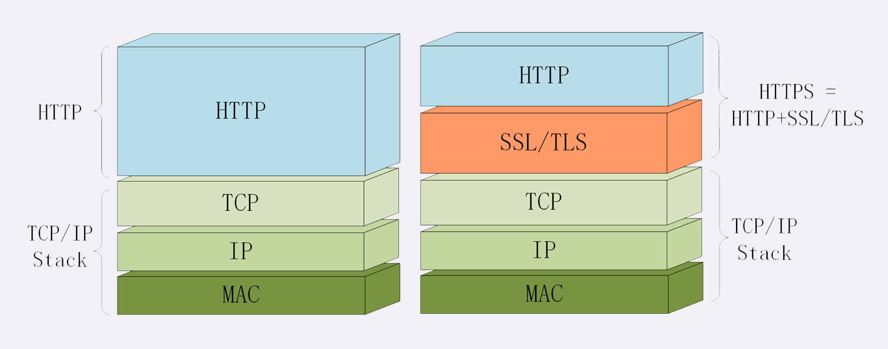
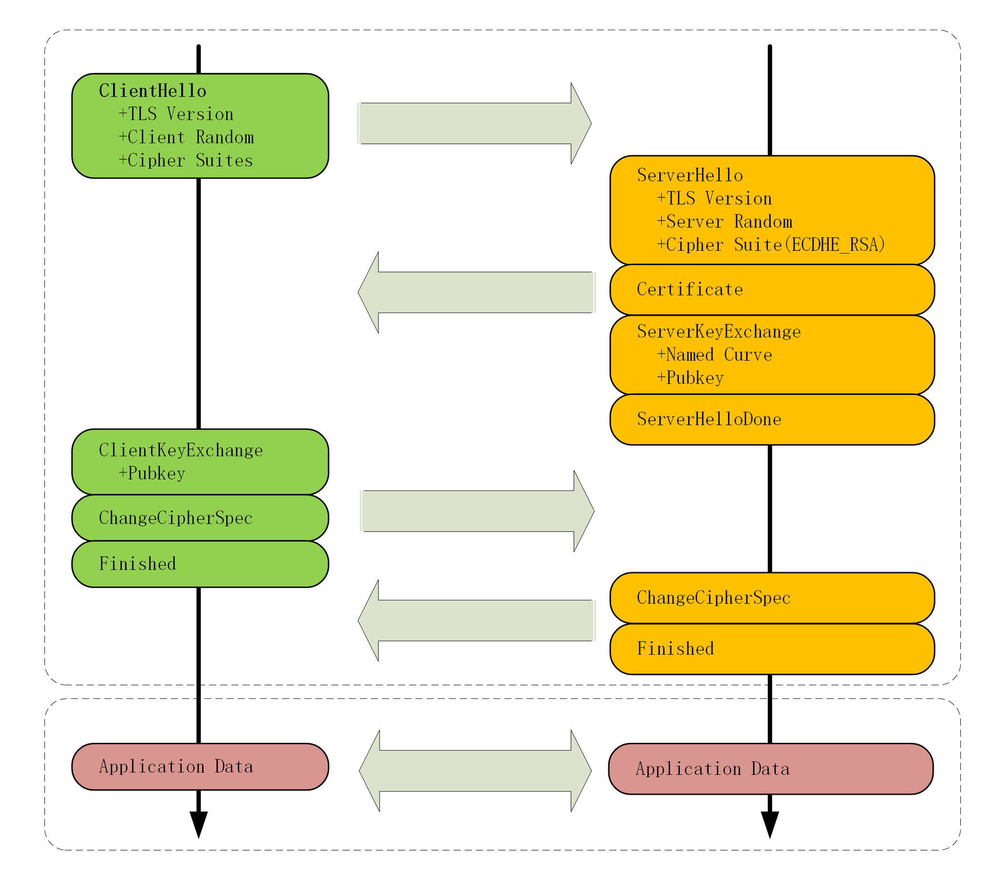
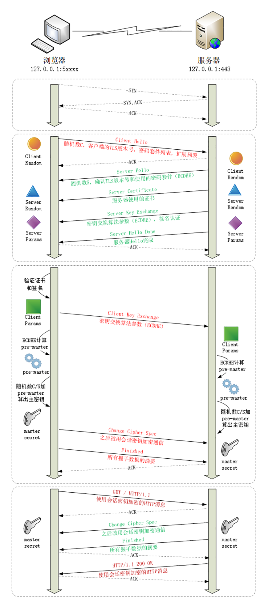

# HTTPS

HTTPS 是 HTTP 的安全版本，它在 HTTP 的基础上添加了一层 SSL/TLS 协议，用于对数据进行加密。它为 HTTP 增加了机密性、完整性、身份认证和不可否认的特性。

SSL/TLS 层结合了两种[加密算法](../../安全/加密算法.md)，同时具备非对称加密的安全性和对称加密的性能。另外利用[数字签名与证书](../../安全/数字签名与证书.md)机制，保证完整性和身份认证。

## HTTPS 握手流程

TLS 握手简要流程如下：

TLS 握手详细流程如下：

1. TCP 三次握手，建立连接；
2. 客户端发送 ClientHello 消息，包含客户端支持的 SSL/TLS 版本、加密算法和随机数，用于生成会话秘钥；
3. 服务器收到 ClientHello 消息后，发送 ServerHello 消息，包含服务器支持的 SSL/TLS 版本、加密算法、密钥交换算法参数和随机数；
4. 服务器为了证明自己的身份，发送自己的证书；
5. 服务器发送自己的公钥，再加上自己的私钥签名认证；
6. 在以上步骤中，客户端和服务器交换了客户端随机数、服务器随机数、服务器证书、公钥和签名。此时客户端会通过服务器证书和签名验证服务器身份；
7. 验证通过后，客户端会生成客户端的密钥交换算法参数，发送给服务器；
8. 此时，客户端会用两方的密钥交换算法参数做计算，生成新的随机数 Pre-Master；
9. 然后，通过客户端随机数、服务器随机数和 Pre-Master 生成主秘钥 Master Secret，在后续的通信中还通过主密钥派生出多个会话秘钥来通信，以避免安全隐患；
10. 最后，客户端会将所有握手数据的摘要加密后发送给服务器，让服务器做验证；
11. 在此之后，所有通信会使用会话秘钥来进行。