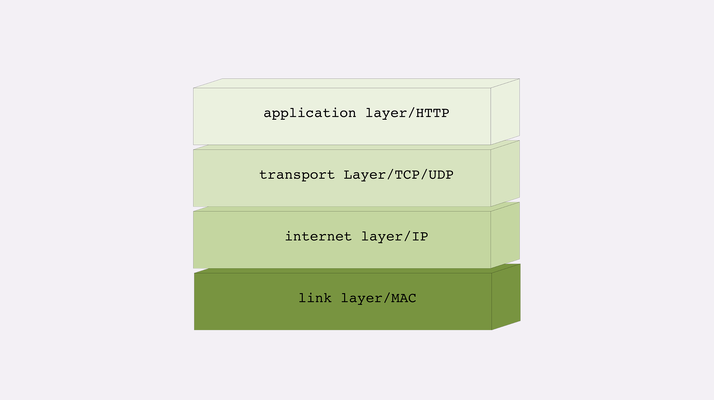
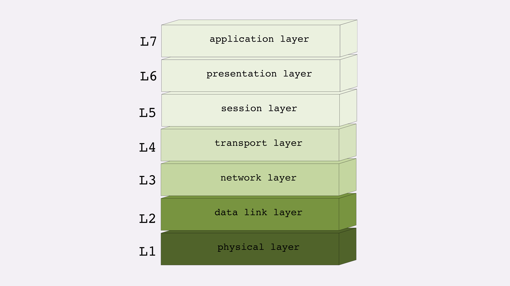
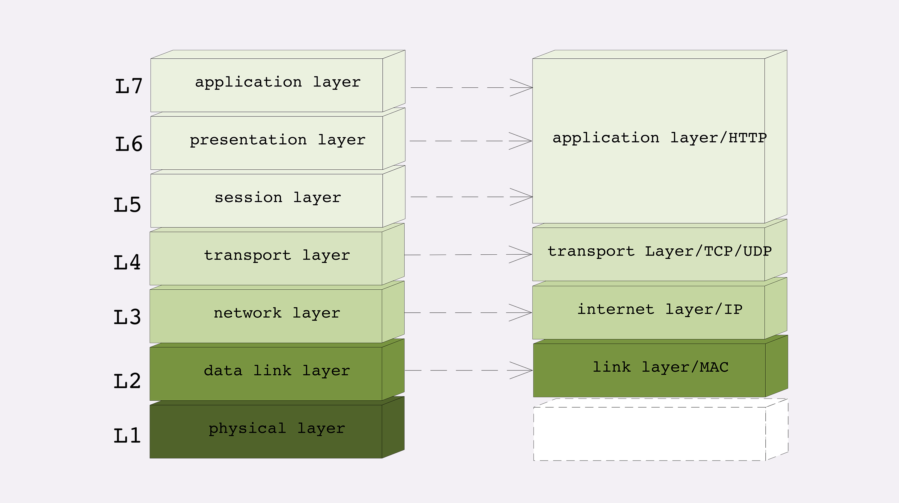
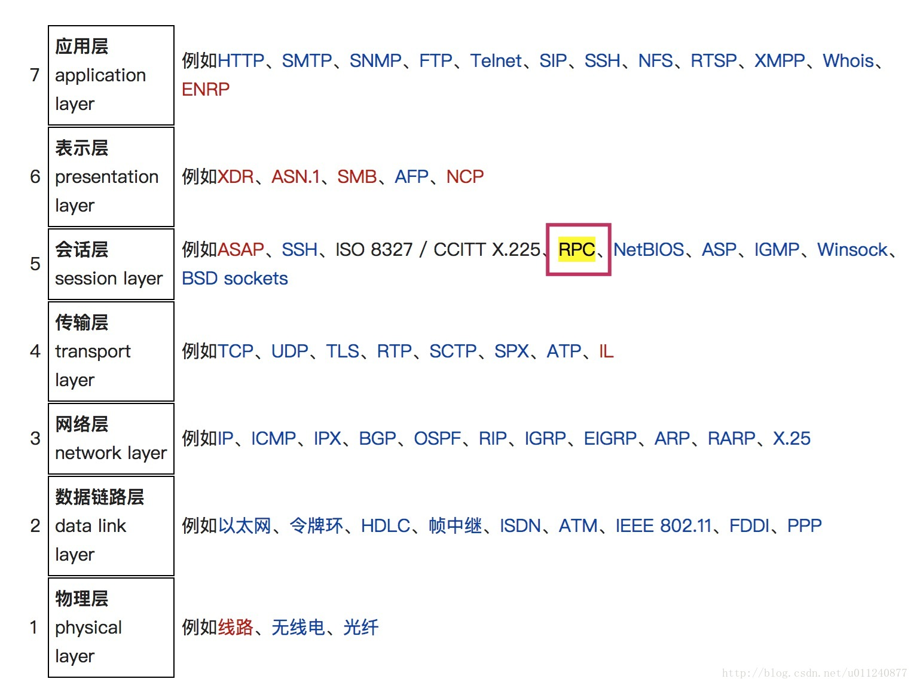

# 网络分层模型

## TCP/IP 网络分层模型

- 链接层 link layer：负责在以太网、WiFi 这样的底层网络上发送原始数据包，工作在网卡这个层次，使用 MAC 地址来标记网络上的设备，所以有时候也叫 MAC 层；
- 网际层 internet layer：包括 IP 协议，IP 地址把许许多多的局域网、广域网连接成一个虚拟的巨大网络，在这个网络里找设备时只要把 IP 地址再“翻译”成 MAC 地址；
- 传输层 transport layer：这个层次协议的职责是保证数据在 IP 地址标记的两点之间“可靠”地传输，包括 TCP、UDP；
- 应用层 application layer：Telnet、SSH、FTP、SMTP、HTTP 等。

## OSI 网络分层模型

- 物理层：网络的物理形式，例如电缆、光纤、网卡、集线器等等；
- 数据链路层：对应 TCP/IP 的链接层；
- 网络层：对应 TCP/IP 里的网际层；
- 传输层：对应 TCP/IP 里的传输层；
- 会话层：维护网络中的连接状态，即保持会话和同步；
- 表示层：把数据转换为合适、可理解的语法和语义；
- 应用层：面向具体的应用传输数据。

TCP/IP 是一个纯软件的栈，没有网络应有的最根基的电缆、网卡等物理设备的位置。而 OSI 则补足了这个缺失，在理论层面上描述网络更加完整。

两种网络分层模型的对应关系如下：

## 网络模型各层包含的协议

